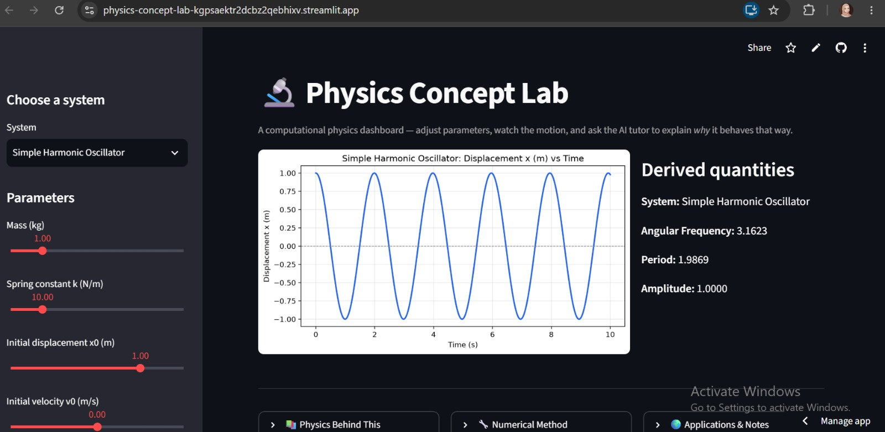
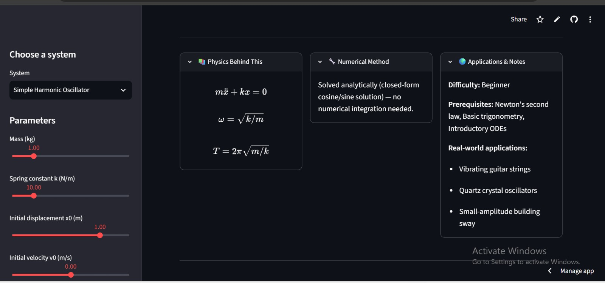
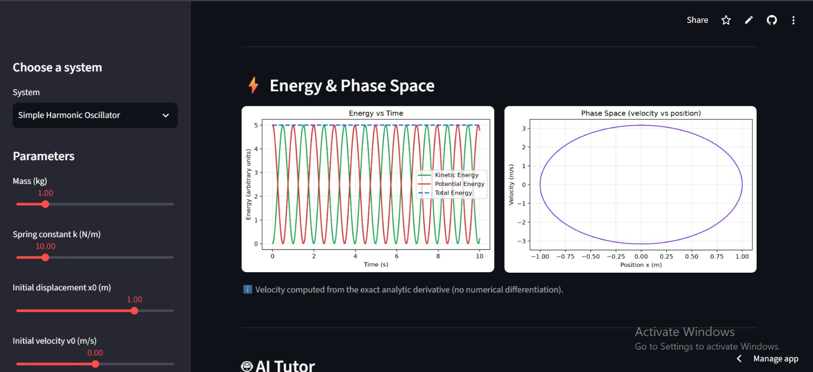
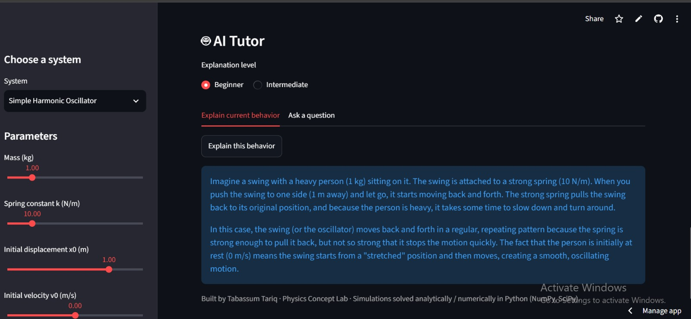

# Physics Concept Lab

An interactive tool that pairs live, adjustable physics simulations with an AI tutor
that explains *why* the system behaves the way it does — not just what it does.

## The problem it solves, and for whom

In most computational physics courses in Pakistan (including my own), students run
simulations, get a plot, and move on — without building real intuition for *why*
changing a parameter changes the behavior. A damping coefficient is just a number
in the code; students rarely connect it to "this is why the oscillation dies out
faster." This app closes that gap: change a parameter, watch the motion update,
and ask an AI tutor to explain the physical reason behind what you're seeing — at
a Beginner or Intermediate level, so it meets you where you are.

**Built for:** undergraduate physics/engineering students learning classical
mechanics computationally for the first time, and for tutors/TAs (like myself,
at QUANTA-S) who want a tool to build intuition in students rather than just
show them a plot.

## Live demo

🔗 https://physics-concept-lab-kgpsaektr2dcbz2qebhixv.streamlit.app/

## Features

- **Ten systems** spanning classical mechanics, electrical circuits, gravitation, and
  continuum physics, all coded and verified by me:
  - Simple Harmonic Oscillator
  - Simple Pendulum (small-angle and full nonlinear solve)
  - Damped Harmonic Oscillator (auto-classifies underdamped / critically damped / overdamped)
  - Projectile Motion (with optional air resistance, numerically solved)
  - Double Pendulum (chaotic — includes a trajectory trace of the second bob to visualize sensitivity to initial conditions)
  - 1D Wave Equation (toggle between Finite Difference and Spectral/Fourier methods — the same comparison I did in my coursework)
  - 1D Heat Diffusion (explicit FTCS scheme, connects directly to my earlier heat-diffusion coursework)
  - RLC Circuit (electrical analog of the damped oscillator — same physics, different domain)
  - Orbital Motion (simplified 2-body gravitation — circular, elliptical, or escape trajectories depending on launch speed)
  - Coupled Oscillators (two masses linked by a spring — demonstrates normal modes and beating)
- **Three visualization modes**, matched to the physics:
  - Time-series / trajectory plots for the mechanics and circuit systems
  - Space-time heatmaps + a snapshot slider for the wave and heat PDEs
  - Orbit and dual-mass trajectory plots for the gravitation and coupled systems
- **Live parameter sliders** for every system.
- **Derived quantities panel** — frequency, period, damping ratio, orbital eccentricity,
  normal-mode frequencies, CFL number, numerical stability checks, and more.
- **"Physics Behind This"** — collapsible LaTeX-rendered governing equations for every system.
- **Numerical Method** panel — states whether each system is solved analytically, via
  SciPy's `solve_ivp` (RK45), finite differences, or the spectral method, and why.
- **Applications & Notes** panel — real-world applications, difficulty level, and
  prerequisite concepts for every system.
- **Energy & phase-space plots** (Kinetic/Potential/Total energy, velocity vs. position)
  for the four systems where the decomposition is clean and pedagogically meaningful:
  SHO, Damped Oscillator, Pendulum, and Coupled Oscillators. Verified numerically —
  energy is conserved to machine precision for the undamped SHO, and visibly decays
  for the damped case.
- **AI Tutor** — explains *why* the system behaves as it does with the current
  parameters, in the student's own words, not textbook boilerplate. Includes a
  follow-up question tab so students can ask something specific
  ("why does increasing k increase the frequency?") instead of only getting a
  generic explanation.
- **Beginner / Intermediate explanation toggle** — same physics, different depth,
  so the tool works whether or not you've studied differential equations yet.

## The AI feature — what it does and the instructions behind it

The AI Tutor is powered by the Groq API (`llama-3.3-70b-versatile`, free tier). When a
student clicks "Explain this behavior," the app sends the current system name,
its parameters, and the derived quantities (frequency, damping ratio, etc.) to
the model, along with a system prompt I wrote myself (see the AI Tutor section in `app.py`) that
instructs it to:

- Explain the **cause**, not just describe the motion
- Adapt vocabulary and depth to the selected level (Beginner vs. Intermediate)
- Always ground the explanation in the *actual numbers* the student chose,
  never generic textbook text
- Stay under 150 words, so it reads like a tutor's answer, not an essay

This was the key design decision: a generic "explain this graph" prompt gives
generic answers. Tying the prompt explicitly to the live parameters is what
makes the explanation feel like it's actually responding to *your* experiment.

## Tools, services, and AI models used to build it

- **Python** — NumPy, SciPy (`odeint` for the nonlinear pendulum solve),
  Matplotlib
- **Streamlit** — web app framework and UI
- **Streamlit Community Cloud** — free hosting/deployment
- **Groq API** (`llama-3.3-70b-versatile`) — AI tutor explanations, free tier
- **GitHub** — version control and public repository
- Built with the assistance of Claude (Anthropic) for code structuring, and
  written/reviewed by me throughout

## Screenshots

### Simple Harmonic Oscillator


### Physics Behind This — Governing Equations


### Energy Conservation and Phase Space


### AI Tutor Explanation

<!-- Add at least 3 screenshots here after running the app locally or on the
     deployed URL. Example markdown:
     
     
     
-->

## How to run the project

### Option A — Run locally

1. Clone the repository:
   ```bash
   git clone https://github.com/YOUR_USERNAME/physics-concept-lab.git
   cd physics-concept-lab
   ```

2. Install dependencies:
   ```bash
   pip install -r requirements.txt
   ```

3. Get a **free** Groq API key from
   [console.groq.com/keys](https://console.groq.com/keys) — sign in, no
   card required, then create a key.

4. Set your API key as an environment variable:
   - **Windows (PowerShell):** `$env:GROQ_API_KEY="your_key_here"`
   - **Mac/Linux:** `export GROQ_API_KEY="your_key_here"`

5. Run the app:
   ```bash
   streamlit run app.py
   ```

6. Open the local URL Streamlit prints (usually `http://localhost:8501`).

### Option B — Use the live deployed app

Just open the live demo URL above — no installation needed.

## Project structure

```
physics-concept-lab/
├── app.py              # Everything: physics simulations, AI tutor, and UI
├── requirements.txt      # Python dependencies
├── .gitignore            # Keeps secrets/cache out of the repo
└── README.md
```

## Author

Tabassum Tariq — BS Computational Physics, Centre for High Energy Physics,
University of the Punjab. Built as the final project for the ACT AI Skillbridge
program.
